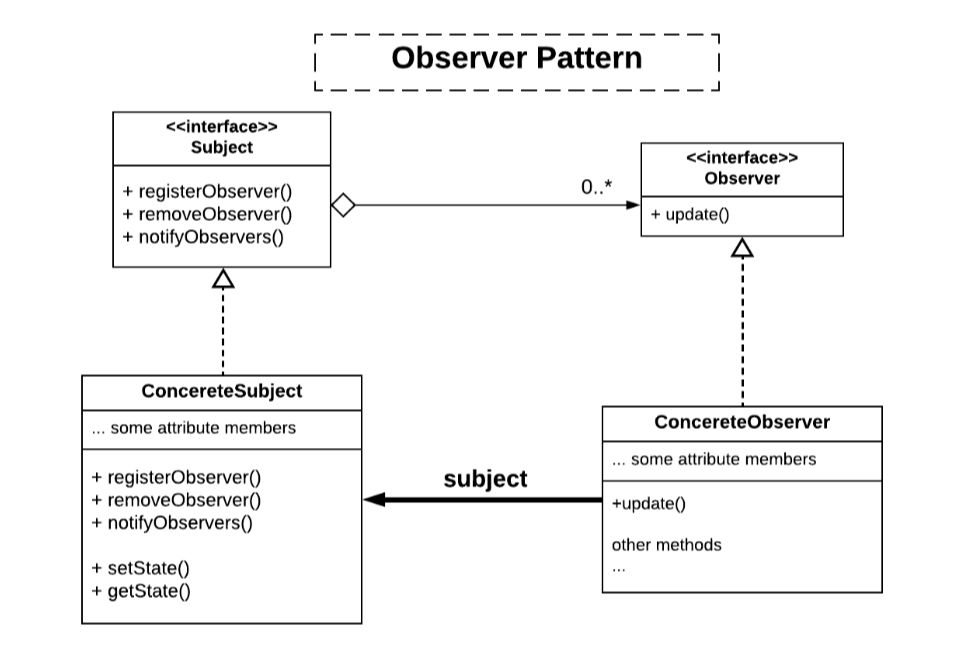
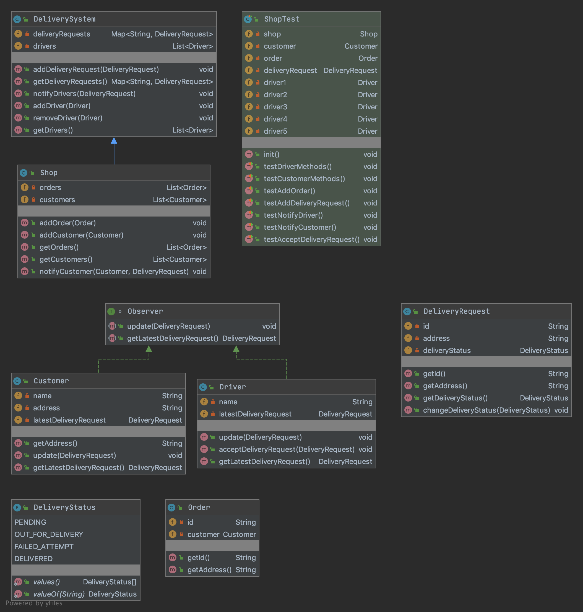
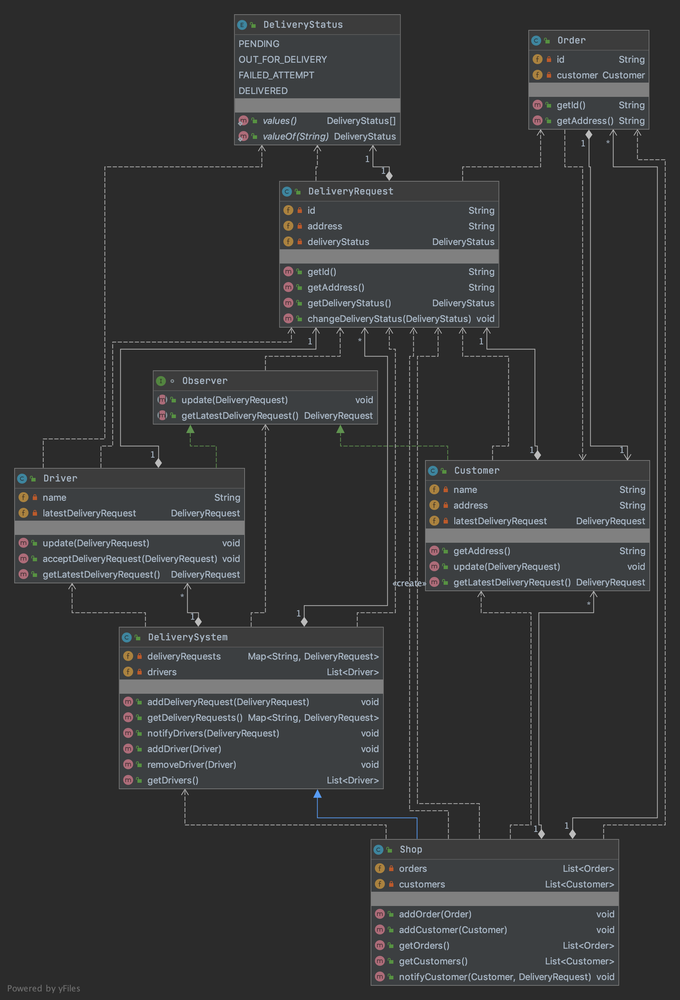

# Delivery Application - Notification System Project

A consortium of shops in a large city has established an agreement with local independent van and taxi drivers to deliver products from city shops to customer destinations.

This project implements a notification system to send notifications about delivery requests to drivers.
When a store gets a product delivery, the store creates an order for a customer, and broadcasts a delivery request to all drivers.

# Software design concepts
The Observer Pattern Structure



```
Subject: DeliverySystem
ConcreteSubject: Shop
Observer: Observer
ConcreteObserver: Customer, Driver
```

- This kind of interaction in observer pattern is also known as publish-subscribe (Pub/Sub).
Whenever there are any updates, we push the new events from the publisher to subscribers.

- The Subject has an Observer that implements the ConcreteObservers.
Whenever the `NotifyDrivers()` method in the Subject is invoked, all the instances of a concrete implementation of the Observer class get updated via their update function.

- The loosely coupled designs allow us to build a flexible object-oriented delivery notification system that can push
  updates and handle changes because they have reduced the interdependency level between objects

- The separation of the Subject and ConcreteSubject classes allows for future extensibility.
The Shop stores a list of customers and orders, and getter/setter methods relating to them. It also has a `NotifyCustomers` method that enables it to notify its customers of delivery status updates. 

# UML Class Diagram





# How to compile the project

We use Apache Maven to compile and run this project. 

You need to install Apache Maven (https://maven.apache.org/)  on your system. 

Type on the command line: 

```bash
mvn clean compile
```

# How to create a binary runnable package 


```bash
mvn clean compile assembly:single
```


# How to run

```bash
mvn -q clean compile exec:java -Dexec.executable="edu.bu.met.cs665.Main" -Dlog4j.configuration="file:log4j.properties"
```

We recommand the above command for running the project. 

Alternativly, you can run the following command. It will generate a single jar file with all of the dependencies. 

```bash
mvn clean compile assembly:single

java -Dlog4j.configuration=file:log4j.properties -classpath ./target/JavaProjectTemplate-1.0-SNAPSHOT-jar-with-dependencies.jar  edu.bu.met.cs665.Main
```


# Run all the unit test classes.


```bash
mvn clean compile test

```

# Using Findbugs 

To see bug detail using the Findbugs GUI, use the following command "mvn findbugs:gui"

Or you can create a XML report by using  


```bash
mvn findbugs:gui 
```

or 


```bash
mvn findbugs:findbugs
```


For more info about FindBugs see 

http://findbugs.sourceforge.net/

And about Maven Findbug plugin see 
https://gleclaire.github.io/findbugs-maven-plugin/index.html


You can install Findbugs Eclipse Plugin 

http://findbugs.sourceforge.net/manual/eclipse.html


SpotBugs https://spotbugs.github.io/ is the spiritual successor of FindBugs.


# Run Checkstyle 

CheckStyle code styling configuration files are in config/ directory. Maven checkstyle plugin is set to use google code style. 
You can change it to other styles like sun checkstyle. 

To analyze this example using CheckStyle run 

```bash
mvn checkstyle:check
```

This will generate a report in XML format


```bash
target/checkstyle-checker.xml
target/checkstyle-result.xml
```

and the following command will generate a report in HTML format that you can open it using a Web browser. 

```bash
mvn checkstyle:checkstyle
```

```bash
target/site/checkstyle.html
```


# Generate  coveralls:report 

You can find more info about coveralls 

https://coveralls.io/

```bash
mvn -DrepoToken=YOUR-REPO-TOCKEN-ON-COVERALLS  cobertura:cobertura coveralls:report
```


